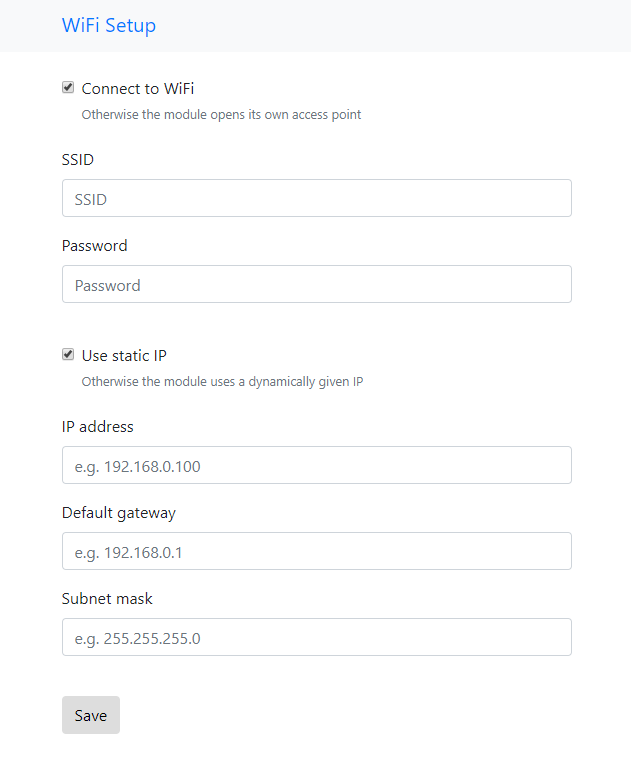

# ESP8266-WiFi-Setup
ESP8266 Webserver that automatically handles the WiFi setup with a webinterface.
This library automatically opens a WiFi Hotspot to which you can connect to and then choose the WiFi settings for the ESP.
These then get stored in the ESP's EEPROM. This WiFi Hotspot uses a captive portal and a DNS server to guide users that connect to the WiFi to the setup page.
If you boot up the ESP8266 the settings get loaded and (if wished so) the ESP tries to connect to your specified hotspot.

Folder "data" contains the website files and should be uploaded to the ESP's SPIFFS via the esp-spiffs-tool (https://github.com/esp8266/arduino-esp8266fs-plugin).

The updated DNSServer has some bugfixes in it so that the captive portal works (https://www.esp8266.com/viewtopic.php?f=32&t=3618&start=40). 

The Ino script contains a simple usage example.
